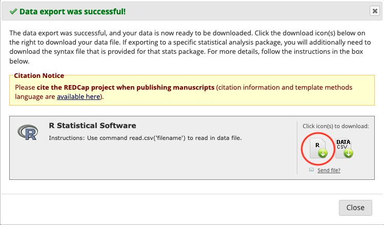
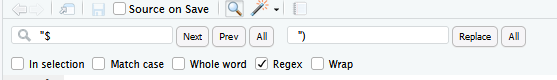

# REDCap

## API pull

1.  REDCap's API can be used to automatically pull records from a REDCap project. Ask your project manager to give you API Export rights and then request an API token via the API page of the project (left hand menu when inside a project). The API option will only appear after the project manager can given you API rights.

2.  Put the API token in your .Renviron file and Restart R. Example format:

```
redcap_token = ABC10000000000000000000000001DFG
redcap_uri = "https://redcap.cir.ed.ac.uk/usher/api/"
```

3.  Go to the API playground in REDCap (left-hand menu inside a project) and from API Method select "Export Records".

4.  Scroll down and look at the R code example. Now, we've not found that copying this exact example works very well for us. But looking at the format can be useful if you've made custom selections at the top, e.g., to pull specific records or variables. In most cases though, you can ignore the example and copy these lines:

```{r, eval = FALSE}
library(tidyverse)
patient_data_orig <- list("token"=Sys.getenv("redcap_token"),
                          content='records',
                          action='export',
                          format='csv',
                          type='flat',
                          csvDelimiter='',
                          rawOrLabel='label',
                          rawOrLabelHeaders='raw',
                          exportCheckboxLabel='true',
                          exportSurveyFields='false',
                          exportDataAccessGroups='false',
                          returnFormat='json') %>% 
  httr::POST(Sys.getenv("redcap_uri"), body = ., encode = "form") %>% 
  httr::content()
```

`httr::content()` runs `readr::read_csv()` to process the result of the API call. So any arguments that you might need to pass to `read_csv()`, can be passed in there, e.g.:

```
httr::content(guess_max = Inf, col_types = cols(.default = "c"))
```

The above code works well for the vast majority of projects. If, however, the project is huge then you'll need to pull data in batches using `redcap_read()` from `library(REDCapR)`: https://github.com/SurgicalInformatics/cocin_ccp/blob/master/01c_data_pull.R


5.  `rawOrLabel='raw'` vs `rawOrLabel='label'`. Pulling raw data will give you categorical variables in their raw coding, e.g., `1, 2` instead of `"Male", "Female"`. Pulling 'labels' will give you the latter, but their factor levels will be ordered alphabetically (as the information on which one was 1 and which one 2 is lost/not pulled). If I'm working with a small dataset with categorical variables that only have a couple of levels each then I find it easier to pull 'labels' and use `fct_relevel()` to order them as necessary. In most cases, however, you'll want to use the exact same ordering that's been set-up on the database. To do this, you'll have to pull 'raw' and apply what's called a REDCap's factoring script.

## Applying a REDCap factoring script

1.  Getting the factoring script: leaving the API playground, click on "Data Exports, Reports, and Stats". On the line where it says "All data", click on Export Data, then select R Statistical Software, then click on Export Data. Then click on the R file:

```{r, out.width = "800px", echo = FALSE}

```

Do not click on DATA CSV, because:

-   this exact data is already coming via the API pull
-   we don't download data onto our computers but pull it directly from REDCap to our secure analysis servers

2.  Move the factoring script to your project directory. The script needs editing to work well with the packages we use. Edit the factoring script as such:

-   Delete the first 7 lines.
-   Instead, add in

```{=html}
<!-- -->
```
    library(finalfit)
    library(magrittr)

3.  Move the labelling section to the bottom of the script. This is because we are about to change it from Hmisc labels to finalfit labels, but the `factor()` function strips the latter. (Tidyverse functions, on the other hand, strip the former.)

4.  Change the labels() code from, e.g.,

```{=html}
<!-- -->
```
    label(data$record_id)="Record ID"
    label(data$redcap_data_access_group)="Data Access Group"
    label(data$sex)="Sex"
    label(data$age)="Age"

to

    data$record_id %<>% ff_label("Record ID")
    data$redcap_data_access_group %<>% ff_label("Data Access Group")
    data$sex %<>% ff_label("Sex")
    data$age %<>% ff_label("Age")

Steps:

-   Remove `label(` from the beginning of each line
-   Replace `)=` with `%<>% ff_label(`
-   Complete each line with `)`

Hints and tips:\
Consider using multiple cursors (click and drag your mouse while holding down Alt on Windows/Linux, or option on a Mac).\
When doing find and replace, make sure to click "In selection" so don't accidentally remove from other sections.\
For adding `)` to the end of line, use:

```{r, out.width = "800px", echo = FALSE}

```

5.  Remove `.factor` from column names as this creates a duplicate of each column.

6.  Apply the factoring script on the pulled data: the factoring script assumes the tibble is called `data`. Instead of going through and changing each instance of this name, do this:

```{=html}
<!-- -->
```
    data = pulled_data
    source("REDCap_factoring_script.r")
    pulled_data = data
    rm(data)

## Alternative to the factoring script: `redcap_label()` from `library(collaboratorR)`

Optional: `redcap_label()` from `library(collaboratorR)` will do factoring for you by applying information from the project's metadata (which is also pulled via the API). Currently, it uses Hmisc labels so not fully compatible with the tidyverse.

## Scannable barcodes in REDCap

Barcodes (1D - like in shops, or 2D - like QR codes) can be useful to allow machines to read data and avoid human mistakes. It can also facilitate de-identification of samples (so they can be processed / handled without compromising any personal information). One use case for this might be if you are doing a study of blood biomarkers on serum, where a separate sample management system might be used to coordinate sample tracking within a laboratory (like a laboratory information management system - LIMS).

To do this, you will need to generate the barcodes, with the appropriate record number in the file name. In this example - we use the `record_id` field in REDCap as the research identifier (NOT a personal identifier) to embed scannable barcodes into REDCap. The advice is to generate many fold more barcodes than you will need. These barcodes should be served either from the web server OR from a public server. Barcodes should not include any personal information.

Once you have generated barcodes / QR codes with appropriate titles, then in REDCap set up three new fields - 1) an image / descriptive text field, then 2 x text fields.

In the text fields, used the `@HIDDEN` and `@DEFAULT` action tags to embed the images, and pipe in the `[record_id]` into the titles.

Piped code example for 1D barcode:

```{r echo=FALSE}
knitr::include_graphics(here::here("img", "1d_barcode.png"))
```

Piped code example for 2D barcode:

```{r echo=FALSE}
knitr::include_graphics(here::here("img", "qr_code.png"))
```

Field layout in REDCap:

```{r echo=FALSE}
knitr::include_graphics(here::here("img", "redcap_layout.png"))
```

Appearance after adding a record:

```{r echo=FALSE, width = 6}
knitr::include_graphics(here::here("img", "barcode_appearance.png"))
```
