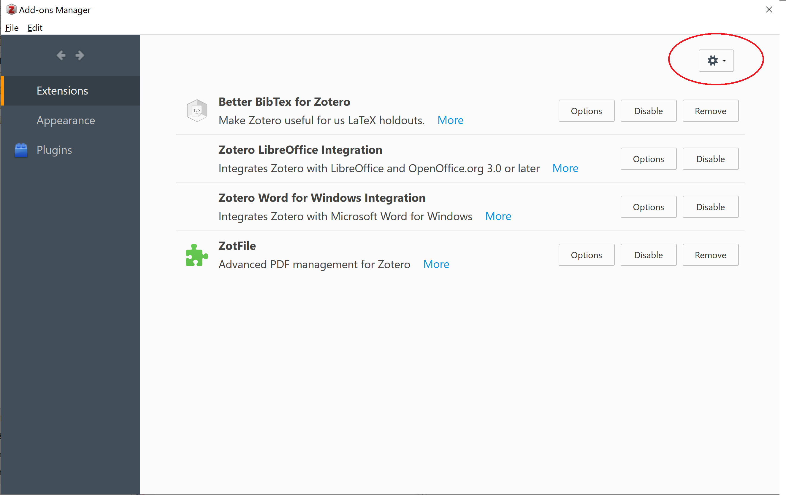
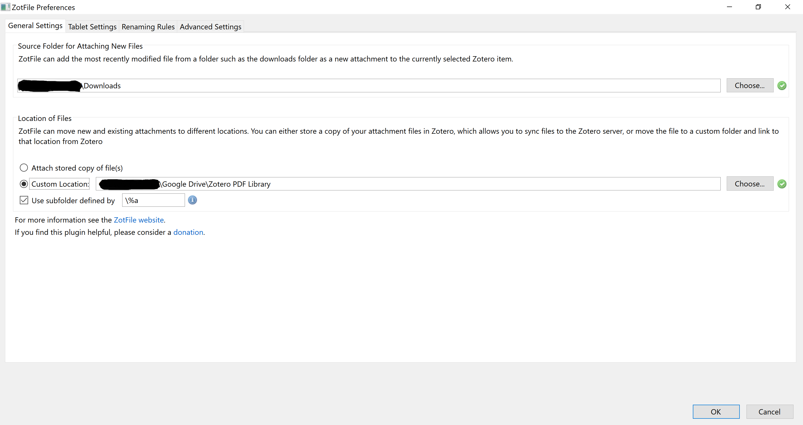
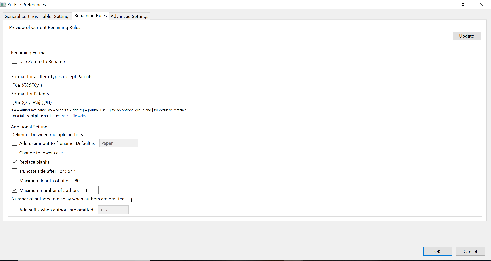
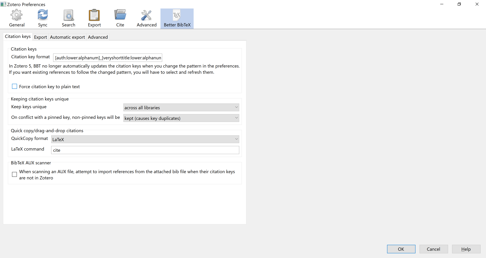

# Citations with R Markdown
Writing publications and other documents requires citations both of academic papers and of R packages.

Zotero provides efficient and free reference management which generates new citation objects with the click of a button in Chrome and easy generation of `.bib` files which can be used to create references in `rmarkdown` and `bookdown`. 

_Top tip: Do this on Day 1 of your PhD!_

## Zotero Set-up
[Zotero](https://www.zotero.org/download/) should be installed and provides 300MB of free storage which covers a few thousand references as long as PDFs are stored elsewhere. The [Chrome connector](https://www.zotero.org/download/) can be downloaded to allow one-click saving of citations. Just click the icon at the top right of the browser to store meta-data and files.

Set up an online account with Zotero so that your data is available remotely. 

[Zotfile](https://www.zotero.org/support/plugins) should be installed to help with PDF storage. Download the `.xpi` file for Zotfile. To install __Zotfile__ open Zotero and go to `Tools → Add-ons → cog in top right corner` and select downloaded `.xpi` file to install.

```{r add-on-install, echo = FALSE, warning = FALSE, fig.cap="Installing a Zotero Plug-in from an .xpi File"}

```

[Better BibTeX](https://github.com/retorquere/zotero-better-bibtex/releases/tag/v6.7.202) is another plug-in which generates citation keys in a robust and reproducible way which is needed for larger projects (e.g. PhDs) to avoid duplicate citation handles. An `.xpi` file can be downloaded from GitHub and installed in the same way (check [Zotero Plug-ins](https://www.zotero.org/support/plugins) for more recent versions if not installing).

## File Storage Set-up
In addition to Zotero set-up it is a good idea to have a cloud storage service to maintain a library of PDFs without using up Zotero storage capacity. These will also need to be accessible to the `Windows Explorer` or the `Mac Finder` - there are several guides on how to do this for [Google Drive](https://www.howtogeek.com/228989/how-to-use-the-desktop-google-drive-app/) and [DropBox](https://www.dropboxforum.com/t5/Installation-and-desktop-app/How-do-I-put-Dropbox-on-my-File-Explorer-in-Win-10/td-p/313031).

## Folder Set-up
### Storing PDFs
Create a folder in a cloud storage service to store PDFs which can be accessed from your own file explorer.

### Storing Bibliographies
Create a folder which will store your `.bib` file. This can then be used to provide the references for your `.rmd` files.

### Subfolder for References
It may be a good idea in Zotero to carefully categorise publications by their content. This makes it very easy to look up publications on a given topic (Zotero allows a citation to be shared across several folders such that a publication documenting an RCT with updated meta-analysis could be in folders for each type of study etc.).

Generally a parent folder will be used to generate a bibliography file and anything likely to be cited in a document / thesis should be in that folder or one of its subfolders.


## Configuring Zotero
### ZotFile PDF Preferences
To setup Zotero so that retrieved PDFs are automatically stored and renamed in the cloud storage without consuming the Zotero storage quota go to “Tools → ZotFile Preferences” and on the first tab: __General Settings__ and set the folder and subfolder naming strategy for PDFs. Set the location of the files to a Custom location in cloud storage e.g.("~\\Google Drive\\Zotero PDF Library"). ZotFile will also store retrieved PDFs in subfolders to help with finding PDFs at a later date. A reasonable setup is to create a subfolder with the first author surname so that all papers authored by one (or more) author with the same name are stored together using the \\%a in the subfolder field. Other alternatives are to store PDFs in subfolders using year (\\%y); journal or publisher (\\%w); or item type (\\%T).

```{r zotfile-preferences, echo = FALSE, warning = FALSE, fig.cap="ZotFile PDF Storage Preferences"}

```


Next the __Renaming Rules__ tab can be configured to provide sensible names to each of the files (this is essential if PDFs are not to be stored as random strings of characters which provide no meaning). Setting the format to: {%a_}{%y_}{%t} provides names for the PDFs in the format of: `Fairfield_2019_Gallstone_Disease_and_the_Risk_of_Cardiovascular_Disease.pdf`. This shows author, year and first word of title without needing to expand the file name.

```{r zotfile-renaming, echo = FALSE, warning = FALSE, fig.cap="ZotFile PDF Storage Preferences"}

```

In the __Advanced Settings__ tab it is strongly recommended to select removal of "Special characters", leaving these in creates problems when knitting to PDF as LaTeX may recognise the special characters in unexpected ways.


### General Zotero Settings
Zotero has several configurable settings (accessed through: “Edit → Preferences”). The following settings are generally helpful (left as default if not mentioned):

__General:__
+ Tick the following:
    + Automatically attach associated PDFs
    + Automatically retrieve metadata for PDFs
    + Automatically rename attachments using parent metadata
    + Automatically tag items with keywords and subject headings
    + All options in Group section
+ Leave the following unticked:
    + Automatically take snapshots
    + Rename linked files

__Sync:__
+ Enter the account details
+ Tick sync automatically
+ Untick sync full text (if you choose to save PDFs then syncing full text will quickly consume the 300MB quota)

__Search:__
+ Leave unchanged

__Export:__
+ Leave unchanged

__Cite:__
+ There are several sensible defaults but if there is a new citation style you wish to be able to use in Microsoft Word for example then click “Get additional styles” as there is probably a version that you need already created. You can click the “+” button to add a style from a `.csl` file if you have one already. Finally, if you are desperate for a style that doesn’t already exist then you can select a citation style and click Style Editor and edit the raw `.csl` file. The `.csl` file for use in `.rmd` doesn't need configured here but instead within the YAML of your .rmd file
+ In the Word Processors subtab (on the main Cite tab), you can install the Microsoft Word add-in to allow Zotero to work in Microsoft Word.

__Advanced:__
+ Change nothing on the General subtab
+ In the Files and Folders subtab select the path to directory for attachments
+ Change nothing on the Shortcuts subtab
+ Change nothing on the Feeds subtab

__Better BibTex:__
+ In this section set the Citation Key format to [auth:lower:alphanum]_[year:alphanum]_[veryshorttitle:lower:alphanum]_[journal:lower:clean:alphanum] (Figure 4). This generates a citation key for each reference in the format of fairfield_2019_gallstones_scientificreports or harrison_2012_hospital_bmj. It always takes the first author’s surname, the year, the first word of the title and the journal abbreviation if known. The clean and alphanum arguments to this field are used to remove unwanted punctuation which can cause citation to fail in LaTeX.

If an author has published an article with the same first word of the title in the same year then the second article appends an "a" to the handle and the third a "b" and so on.

```{r zotfile-citation-key, echo = FALSE, warning = FALSE, fig.cap="ZotFile PDF Storage Preferences"}

```

### Refresh BibTex Citation Key
If you already have used Zotero without this setup and want to refresh your citation keys to follow the standard pattern then select all references, right click and use “Better BibTex → Refresh BibTeX Key”.

## Generating a .bib File
For referencing in a new project, publication or submission it may be helpful to have a dynamic `.bib` file that updates with every new publication added to Zotero and can be accessed from any device through cloud storage.

To set up a `.bib` file, first find the folder that you wish to create the file from (this should be the folder which contains any citations you will use and ideally not the full library to cut down on unnecessary storage and syncing requirements). 

Note that the `.bib` file will generate a bibliography from any citations stored directly in the folder when using default settings. This prevents use of subfolders which are particularly helpful for organising citations so it may be helpful to change the setting so that folders also show any citations stored in subfolders. To make this change go to “Edit Preferences” and select the “Advanced” tab and at the bottom of the “General” subtab select “Config Editor”. This will bring up a searchable list of configurations (it may show a warning message before this) and search in the search box for “extensions.zotero.recursiveCollections”. Set “Value” to TRUE and then when you click a folder you should see all of the citations also stored in subfolders.

Right click the folder which has all of the references (with or without subfolders) and select “Export Collection”. A pop-up window will appear at which point select “Keep Updated” and if using RStudio desktop save the file in the directory where you have your `.rmd` project files. If you are working with RStudio server then save the file in a cloud storage location which will then be accessed from the server. A `.bib` file stored in Dropbox can be copied into RStudio server for a given project as per below.


## Linking DropBox and Rstudio Server
Dropbox provides a token to allow communication between different apps. The `rdrop2` package allows this. It may be necessary to create the token on RStudio desktop as creation on the server is buggy but this is perfectly ok.

__Caution:__ The token generated by this process could be used to access your Dropbox from anywhere using RStudio if you do not keep it secure. If somebody were to access an unencrypted token then it would be equivalent to handing out your email and password. Use the `encryptr` package to allow safe storage of this token.

### Token Creation

The code will create two files, a token and the `.httr-oauth` file from which a token can also be made. The encryptr package can then encrypt the files using a public / private key pair. It is essential that the password that is set when using genkeys() is remembered otherwise the token cannot then be used. In this case the original token can’t be retrieved but could be created again from scratch.

```{r dropbox-token-creation, eval = FALSE, echo = TRUE}
library(rdrop2)
library(encryptr)
 
# Create token
token <- drop_auth()
 
# Save token
saveRDS(token, "droptoken.rds")
 
# Encrypt token
genkeys()               # Default file names are id_rsa and id_rsa.pub
encrypt_file("droptoken.rds", "droptoken.rds.encryptr.bin")
encrypt_file(".httr-oauth", ".httr-oauth.encryptr.bin")
 
# Same details should appear later
drop_acc()
 
# Remove token from local environment
rm(token)
 
 
# Delete the unencrypted files
system("rm droptoken.rds")
system("rm .httr-oauth")
```

The following files will then be needed to upload to the RStudio server:

+ `droptoken.rds.encryptr.bin` – or the name provided for the encrypted DropBox token
+ `id_rsa` – or the name provided for the private key from the private / public key pair

### DropBox Linkage

Now that the encrypted token and necessary (password-protected) private key are available in RStudio server, the following can be saved as a separate script. The script is designed to read in and decrypt the encrypted token (this will require a password and should be done if the .bib file needs updated). Only the drop_download() needs repeated if using the token again during the same session. The token should be cleared at the end of every session for additional security.

```{r dropbox-server-linage, eval = FALSE, echo = TRUE}
library(rdrop2)
library(encryptr)
 
# ******** WARNING ********
# Losing the unencrypted token will give anyone 
# complete control of your Dropbox account
# If you are concerned this has happened,
# you can then revoke the rdrop2 app from your
# dropbox account and start over.
# ******** WARNING ********
 
 
safely_extract_dropbox_token <- function(encrypted_db_token = NULL, 
                                         private_key_file = NULL){
  decrypt_file(encrypted_db_token, 
               file_name = "temporary_dropbox_token.rds", 
               private_key_path = private_key_file)
  
  token <<- readRDS("temporary_dropbox_token.rds")
  
  system("rm temporary_dropbox_token.rds")
}
 
safely_extract_dropbox_token(encrypted_db_token = "droptoken.rds.encryptr.bin", 
                             private_key_file = "id_rsa")
 
# Then pass the token to each drop_ function
drop_acc(dtoken = token)
 
# The path is the Dropbox file location
drop_download(path = "My_Dropbox_Home_Directory/Zotero Library/my.bib", 
              local_path = "my.bib", 
              dtoken = token,
              overwrite = TRUE)
```

Now that the `.bib` file has been created and is stored as “my.bib” in the local directory, it should update whenever the token is loaded and drop_download() is run. The `.bib` file should be listed in the `.rmd` YAML.

## Citing R Packages
When citing R packages a separate `.bib` file can be created. The following code could be added to an `index.rmd` file in `bookdown` or in a setup chunk in a stand-alone `.rmd`.

```{r eval=FALSE, echo = TRUE}
# automatically create a bib database for R packages
knitr::write_bib(c(
  .packages(), 'encryptr', 'knitr', 'rmarkdown'
), 'packages.bib')
```

